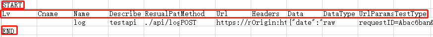

DetailedSteps
=======
在这里介绍如何使用 `bluetest` 一步一步完成工作。

首先让我们看下 `bluetest` 里的主要 ``.py`` 文件
    
   * ``logInit.py`` 日志相关
   * ``parm.py`` 配置参数
   * ``press.py`` 压测相关
   * ``toolbox.py`` 工具箱
   * ``dome_test.py`` 范例
   * ``core.py`` 接口基础测试相关
 

准备数据 
------
我们从第一步开始，准备数据。
按照我们的约定，做接口测试的源数据可以是 ``postman`` 里download下来的数据。如下图所示：

.. figure:: _static/screenshots/dtailedsteps_postman.png
    :align: center

这样我们就获得了最原始的数据 ``test.json.postman_collection`` 名字很长，这是postman规定的，请暂时忍受一下。

由于这个文件的可读性比较差，而且不利于维护和使用，所以需要生成一个中间文件，在这里选用的是 ``csv`` 格式。

``csv`` 作为 `BlueTest` 的标准数据文件，为了支持这一实现方式。
  
还提供了 ``postman`` 文件, 标准 ``swagger`` ，标准 ``YAPI`` 一键转换为 ``csv`` 的功能
  
而且不用担心，如果你的数据源不是以上格式，在后面的详细介绍中，会有 ``csv``文件格式的详细说明。可根据说明，编写自己的测试数据一键转换功能。

.. code-block:: python

    BlueTest.initPostMan(name,result_path = "")
    
**function initPostMan**
    

我们的一贯命名方式就是，中国式英语 - 命名风格。
顾名思义，这个函数的功能是初始化 ``postman`` 的数据。
调用方式可以有以下几种

.. code-block:: python

    BlueTest.initPostMan(name = "文件名缩写")  #test.json.postman_collection 则只需要 initPostMan（"test"）
    BlueTest.initPostMan(name = "文件完整路径") #完整的文件相对路径/绝对路径
    BlueTest.initPostMan(name = "文件名缩写",result_path = "转换后文件路径") 
    
result_path 不建议填写，不填写，会直接在 ``./srcdata/``  文件生成与数据源同名的文件，例test.json.postman_collection-> test.csv

initPostMan是如何工作的呢？

它的主要工作其实其实是进行文件名处理。除此以外的大部分功能其实是由我们一个类 `Class Postman2Csv` 来处理的。

首先initPostMan会将不确定的文件名（缩写，完整路径，绝对路径等） 进行处理后，变为标准格式后。将工作交于 `Class Postman2Csv` 。

.. code-block:: python

    postman2csv = BlueTest.Postman2Csv(path,result_path="")
    postman2csv.run()
    
**Class Postman2Csv**

PostMan文件转换为Csv所使用的类。除了一大堆为了处理各种各样奇怪情况的代码以外。主要的进行工作的函数有:

.. code-block:: python

    data = postman2csv.getData(Cookie=False)   
    
在这里有个常见的单词 `Cookie` ，由于PostMan导出的文件时常会带有一大堆很不重要的Cookie内容。为了降低后期的结果整理压力。在这里，我们默认关闭了Cookie选项。毕竟的用户鉴权，很多都不在Cookie里了，不论是单独的 Token,Sign 键值，还是Session方式。都更加流行。

当然，如果你还需要这个功能，可手动开启。

回到原来的话题，这个函数的功能是，用来获取 ``.postman_collection`` 文件的内容。并输出标准一个漂亮的数组，数组的内容是一堆长得不是很讨人喜欢的字典键值。

这样，我们就对 ``.postman_collection`` 文件进行了漂亮的序列化。这些数据的形状就任我们揉捏了。揉捏好的数据，按照约定，我们将它们变成 ``csv`` 格式。这就使用到了下一个函数。

.. code-block:: python

    postman2csv.write2Csv(data)   
    
write2Csv = =  write to csv 。如果你还看不明白含义，那么不是你的英文太好。就是中文不太好。 ``写入文件为csv格式`` 

除了枯燥的将之前我们生成的漂亮数组 ``data`` 一条一条写入文件外。还增加了一些标志。用来加强可读性。

从上图可以看出，除了一行比较啰嗦的title以外，主要的标志有： ``START`` , ``END`` 

这两个标志位是用来规定每个测试用例的范围。

在这两个标志位以内就是一个测试用例，在这两个标志位以外的区域可以任由大家进行备注，而不影响测试用例。也算是在可读性和易读性之间的一种平衡。以上的工作搞定之后，如果你幸运的没有出现异常，那么测试数据的准备工作已经全部完成了

接口测试
------
由于每个人，每个部门，每个公司的业务需求千奇百怪，所以，作为一个通用性的库。故我们暂时不考虑这些特性的东西。先把共性的问题解决。比如 ``值为空`` ``键值均为空`` ``额外参数校验`` ``参数长度校验`` 

`bluetest` 对以上功能均做到了一键式的执行。改点配置，执行，你就能获得一堆漂亮(啰嗦)的测试数据。使用者的工作，就从一个一个机械化的填异常参数，变成了只要点一下。
 
如何进行测试，如何配置这些东西呢？我们一步一步来。
 
* 首先确保数据准备好了，有一个生成的csv文件
* 然后执行以下语句

 .. code-block:: python

    BlueTest.testByCsvData(name,normal_test=True,mkpy=False,limit_check = False,extras_check=True)
    # csv 名称（test.csv->testByCsvData("test") ） or 绝对路径/相对路径 (testByCsvData("./tmp/test.csv") )
    # normal_test 基础测试 
    # mkpy实时生成单接口.py文件
    # limit_check 参数长度校验
    # extras_check额外参数校验

* 执行结束之后。恭喜你，做完了。去 ``./result/data.txt`` 里看结果吧

收起你一脸蒙蔽的表情，没错。做完了。整理数据，去发测试报告吧！但是如何执行的，你肯定很好奇。我们再次一步一步来。

**function testByCsvData**

依据 ``csv`` 数据进行测试，一堆入参的含义就不赘述了。它的主要工作其实和 `initPostMan` 很相似。主要做的是入参标准化。之后实例化了 ``Class Csv2Dict`` ，``class Dict2Py``  和 ``class ApiTest`` 

**Class Csv2Dict**
这是又一次做序列化的工作了。这次是把标准的中间文件 ``csv`` 处理为使用起来最舒服的字典类型。

 .. code-block:: python
    
    >>>import BlueTest
    >>>csv2dict = BlueTest.Csv2Dict("./srcdata/test.csv").run()
    >>>for key,value in csv2dict[0].items():
    >>>    print (key,":",value)
    - DEBUG: CSV文件内容utf8序列化失败重试:'utf-8' codec can't decode ...
    - DEBUG: CSV文件内容序列化成功:[{'Lv': ''....
    Lv : 
    Cname : 
    Name : log
    Describe : testapi
    ResualPath : ./api/log
    Method : POST
    Url : https://www.test.com/action/api/log
    Headers : {'Origin': 'https://www.TEST.net', 'User...
    Data : {"date":"2018-11-04 10:21:06","action...
    DataType : raw
    UrlParams : {'requestID': 'Abac6b...
    TestType : 
    
以上是一个完整的测试数据，部分空的内容，是预留给你使用的，当然，理想的情况是不使用。那就说明， `bluetest` 已经满足你的需求了。

**Class Dict2Py**

大家在使用 ``postman`` 的时候，应该玩过 ``Generate Code`` 这个漂亮的功能，可以将内容一键转为各种你需要的语言代码。一个很好，很实用的功能。所以，我们很谦虚（无耻）的兼容（抄袭）了这个功能。这个类就是做这件事情的。

 .. code-block:: python
    
    >>>import BlueTest
    >>>csv2dict = BlueTest.Csv2Dict("./srcdata/test.csv").run()
    >>>BlueTest.dict2Py(data = csv2dict[0]).mkpy()
    
执行后，我们获得了 ``./result/api/log.py`` 可以发现地址和上面的某一条 ↓↓

 .. code-block:: python
 
    ResualPath : ./api/log
    
↑↑ 一致。所以大家不用担心，自己的生成的文件会被推在一起，造成困扰。
    
**Class ApiTest**

接口测试的基类

 .. code-block:: python
    
    >>>import BlueTest
    >>>apitest = BlueTest.ApiTest(data)
    
还是一样，从csv里抽一条数据作为入参，来实例化基类。在基类的构造函数来里可以看到，里面对接口的一些测试标准进行了配置。，而且一切的初始化都是基于 ``param.py`` ,详细的配置内容，请自行查看相关文件。

在实例化获得 ``apitest`` 后，众所周知，构造函数已经运行了。这个时候。我们的数据准备已经完成。
执行具体的接口校验工作的方法有 ``limitCheck`` (长度校验) ``exceptionCheck`` (空校验) ``extrasCheck`` (额外参数校验)。
校验的执行方式如下：

 .. code-block:: python
    
    >>>csv2dict = BlueTest.Csv2Dict("./srcdata/test.csv").run()   
    >>>apitest.dataReduction(csv2dict[0])   #正常用法
    >>>apitest.dataReduction(csv2dict[0],limitcheck=True,extras_check=True)   #进行部分校验的用法
    
至此。接口测试的活干完了。之后就是结果分析和统计了。相关内容将在结果分析相关章节里进行叙述。
为了便于大家使用。接口基础测试的完整代码如下:

 .. code-block:: python
    
    >>>#确保该路径下，存在该文件 ./srcdata/test.json.postman_collection
    >>>BlueTest.initPostMan("test")       #数据准备 
    >>>BlueTest.testByCsvData("test")     #测试执行
    
压力测试
------
关于接口，除了日常的接口测试外，还有时常遇到的压力测试。由于现在更多的服务器在云端，而且各个云服务提供商，都有非常好的系统/应用监控系统。故，我们暂时跳过了服务器的监听。这些，大家只要根据时间戳，找运维拉数据就行。大家也不用痛苦的在服务器上安装JmeterPlugins之类的工具来监听了。毕竟专业的事情交给专业的人，这样才能提高效率和更好的做好自己本职的工作。世上从来不存在高大全的系统。也不存在完美的人。

还是先来几个例子：

**Demo1**

 .. code-block:: python
    
    >>>import BlueTest,random
    >>>class PressTest(BlueTest.SoloPress):
            def runcase(self):
                response = random.choice(["成功","失败"])
                self.file_write(str(self.num), response, BlueTest.toolbox.responseAssert(response))
        press= BlueTest.Press(2) #线程数
        press.run(PressTest)
        press.dataReduction()

**Demo2**

 .. code-block:: python
    
    >>>import BlueTest
    >>> csv_data = BlueTest.Csv2Dict(path="./srcdata/test.csv").run()
        apitest = BlueTest.apiTest(csv_data[0])
        class PressTest(BlueTest.SoloPress):
            def runcase(self):
                response = apitest.soloRequest()
                self.file_write(str(self.num),response,b.responseAssert(response))
        press= BlueTest.Press(2) #线程数
        press.run(PressTest)
        press.dataReduction()
        
**Demo3**

 .. code-block:: python
    
    >>>import BlueTest
    >>> temp = ["id1", "id2", "id3"]   #①
        apitest = BlueTest.apiTest(csv_data[0])
        class PressTest(BlueTest.SoloPress):
            def setup(self):
                self.num = temp[self.index-1] #②
            def runcase(self):
                apitest.data[BlueTest.csv_parm.DATA]["ID"] = self.num #③
                response = apitest.soloRequest()
                self.file_write(str(self.num),response,b.responseAssert(response))
        press= BlueTest.Press(3) #线程数
        press.run(PressTest)
        press.dataReduction()
        
如果大家耐得住性子的话，会看出。这三个例子明显的区别。 ``Demo1`` 使用的是随机生成的假数据。 ``Demo2`` 使用的是csv里的第一个接口的数据 ``Demo3`` 在 ``Demo2`` 的基础上，增加了一些自定义参数。

从实际使用的角度而言， ``Demo3`` 是我们再实际工作中最常使用到的。除了大部分的模板式代码以外。其实需要手动编写的主要部分是自定义数据的部分。
全部的代码大概3行。 ① 数据初始化 ，②  线程获初始化据数，  ③    执行前，赋值。  

Demo大家看到了。除此以外， `BlueTest` 里，也自带了两个相关的demo 

 .. code-block:: python
    
    >>>import BlueTest
    >>>BlueTest.presstest()
    >>>BlueTest.pressTestByCsv()
    end
    
``presstest()`` 执行肯定不会出现问题的，因为数据是我们随机生成的。但是 ``pressTestByCsv()`` 如果出问题的话.....放心，不会是大问题，耐心点
 
Demo说完，我们开始一步一步介绍，到底是如何工作的
 
**Class Press**
 
大家可以理解为，这是一个多线程的盒子，它自动生成多线程（我们最讨厌的东西）。实例化这个类的时候。就直接确定了，产生的线程数
 
.. code-block:: python

    >>>import BlueTest
    >>>BlueTest.Press(线程数)
    
除此之外，压力测试最重要的一点就是对执行数据的整理，因为这才是我们需要的。这才是最后测试报告里需要体现的内容。为此我们写了一个方法 ``dataReduction``
 
**function dataReduction**
 
这是 ``Class Press`` 中用来进行数据整理的方法。入参默认不填，或者填入你的压测结果路径 ``Press_press.log``。
数据是基于三个维度进行的整理:
 
* 自然时间流失过程中，接口请求的效率
* 所有请求的耗时
* 请求的成功率

为了便于统计和整理。我们将原始数据里的毫秒级数据整合成了秒级的数据（请求耗时除外）。并且输出位表格格式 ``time.csv`` ，``resualt.csv``
 ``time.csv``

 .. figure:: _static/screenshots/dtailedsteps_timecsv.png
    :align: center

可以看到，左侧是根据请求耗时（毫秒）对请求进行的统计。当然，图中右边的图表需要大家使用excel手动生成。

 ``resualt.csv``
 
 .. figure:: _static/screenshots/dtailedsteps_resualtcsv.png
    :align: center
 
时间轴变成了秒，并增加了成功与失败的统计。
 
在不进行调优的情况下，作为客户端可以看到的大部分内容，都已经包含在 ``resualt`` 和 ``time`` 中。服务端的数据，大家可以根据 ``resualt.csv`` 中的时间戳，从监控系统中获取相关服务端状态和日志。当然，建议大家还是骚扰相关管理员或者运维来获取相关内容。

**function run**
作为 ``Class Press`` 中的主执行函数，它的入参比较特别，是一个类 ``Class SoloPress`` 。具体这个类是做什么我们稍后再讨论，先假设，我们已经有这么一个类了。让我们看一下 ``function run`` 究竟干什么了。

 .. code-block:: python
    
    >>>def run(self,solopress):
            ThreadList = []
            lock = threading.Lock()
            for i in range(1, self.num+1):
                t = solopress(lock,i)
                t.setup()
                ThreadList.append(t)
            for t in ThreadList:
                self.runSleep()
                t.start()
            for t in ThreadList:
                t.join()

代码很短，而且很常见，简单来说。就是根据线程数　``self.num`` 来新建线程，并运行他们。关于 ``threading.Lock()`` 的相关内容就不再这里说了。毕竟，锁是一个很复杂的东西。

简单的总结一下 ``Class Press`` 就有一个用来新建多线程，执行。并最后进行数据整理的类。
下面介绍下，出现了好几次的 ``Class SoloPress`` 。

**Class SoloPress**

从所继承的父类可以看出来 ``Class Press`` 继承的是object。 ``Class SoloPress`` 继承的是 threading.Thread。由此也可以看到，SoloPress与多线程相关，所以继承了线程控制类。按照正常的使用方法。我们需要重写部分函数函数:数据准备函数 ``function setup`` ，单次执行函数 ``funciton runCase`` 。这里要介绍的不是这些注定要被大家重写的函数。如果想了解用法请看上面的DEMO。而是主要介绍一下 ``Class SoloPress`` 本身为用户做了什么事。

**function run** 

按照正常情况，run函数是类实例化后的主执行函数。所以在这里。我们做了单线程的接口调用。除了执行规定次数的 ``runCase`` 外，还进行了一些其他辅助类的工作，比如:线程执行的进度展示，执行数据的记录... 听上去是一些无关紧要的东西。但是却能提高很多用户体验，毕竟，谁也不想执行代码后，只能经过一段没有进度的等待，获得一堆没有规划好的数据。

                
    
    

